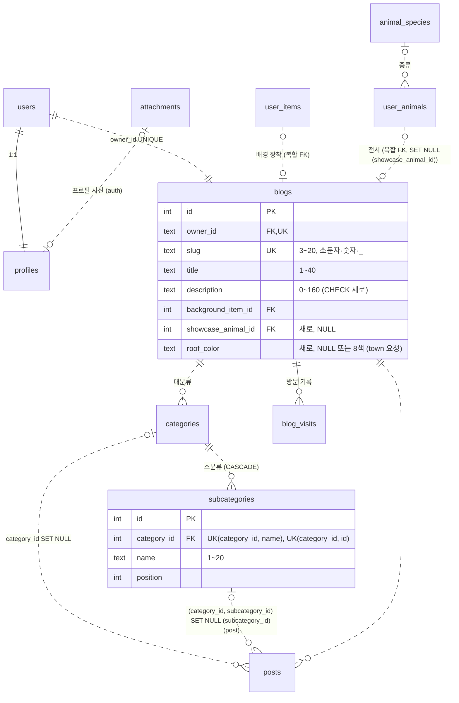

# Data Model: 블로그 (BLOG)

**Feature**: `002-blog` | **Date**: 2026-10-07 | **Plan**: [plan.md](plan.md) | **Research**: [research.md](research.md)

- DB 설계 원본은 코드 저장소 `docs/02-erd.md` v1.4다. 이 문서는 그중 블로그 영역의 **현재(`src/db/schema.ts`, 마이그레이션 `0000`~`0006`)와 목표**를 비교한다.
- 테이블 담당 규칙(공통 맥락 3.1): 이 spec이 담당하는 표는 **변경**, 다른 spec 담당 표는 **참조**로 적는다. 다른 spec에 필요한 구조 변경은 `참조 (요청: …)`로 적고 plan의 의존성에 넣었다.
- 실제 DB 타입은 글자 `text` + 길이 CHECK, 번호 `integer generated always as identity`, 시각 `timestamptz`다 (ERD 부록 첫 문단). ERD의 `VARCHAR(n)`·`SMALLINT` 표기로 타입을 바꾸지 않는다.

## 1. 테이블 구분 한눈에

| 테이블 | 구분 | 내용 |
|---|---|---|
| `subcategories` | 변경 (새 테이블) | 소분류. `category_id` FK CASCADE, 이름 1~20, 순서, UNIQUE(`category_id`, `name`), UNIQUE(`category_id`, `id`) (BLOG-05, ERD 3.18) |
| `blogs` | 변경 | `showcase_animal_id` NULL + 복합 FK → `user_animals`(`user_id`, `id`) `ON DELETE SET NULL (showcase_animal_id)` (BLOG-04, ERD 3.11) |
| `blogs` | 변경 | CHECK `char_length(description) <= 160` 추가 (BLOG-03, 원본 열린 질문) |
| `blogs` | 변경 (요청: town, TOWN-07) | `roof_color` NULL + 8색 CHECK. NULL = 배경 색 따라가기 |
| `categories` | 변경 없음 (담당) | 구조 그대로 "대분류"로 쓴다. 바뀌는 것은 Server Action 동작(블로그 행 잠금, 삭제 뒤 번호 다시 매기기, 삭제 전 글 칸 비우기) |
| `blog_visits` | 변경 없음 (담당) | BLOG-06 이미 구현 (`0006_blog_visits`). 규칙 그대로 |
| `posts` | 참조 (요청: post가 `subcategory_id` + 복합 FK `ON DELETE SET NULL (subcategory_id)` + CHECK(`subcategory_id IS NULL OR category_id IS NOT NULL`) + 트리거 `posts_clear_subcategory`를 추가) | 블로그 홈 목록·거르기·글 수, 검색(`title`, `content_text`, `visibility`). 측정 뒤 필요하면 `pg_trgm`·`category_id`·`subcategory_id` 인덱스를 post에 요청 |
| `profiles` | 참조 (요청: auth가 `nickname` CHECK 2~20, `photo_key` 추가) | 닉네임 변경(UPDATE), 미니룸 배지, 주인 프로필 사진 |
| `users` | 참조 (요청: auth가 `username` NOT NULL) | 주소·닉네임과 다른 회원 아이디의 겹침 검사, 관리자 판정(`role`) |
| `user_animals` | 참조 (요청: town이 UNIQUE(`user_id`, `id`) 추가) | 도감(다 키운 동물), 전시 동물 복합 FK의 대상 |
| `animal_species` | 참조 | 도감 카드 이름·그림 키 |
| `items`, `user_items` | 참조 | 미니룸 캐릭터·배경 그림 키, 배경 장착 복합 FK(기존) |
| `follows` | 참조 | 블로그 홈 `이웃 N` (주인을 이웃 추가한 수) |
| `attachments` | 참조 | 프로필 사진(`profiles.photo_key`가 가리킴) |

이 spec이 담당하는 열거형은 없다. 검색·목록에 쓰는 `visibility`는 post 담당이다.

## 2. 엔터티

### 2.1 블로그 (`blogs`, 변경)

| 컬럼 | 현재 | 목표 | 규칙과 출처 |
|---|---|---|---|
| `id` | integer identity PK | 그대로 | |
| `owner_id` | text NOT NULL, UNIQUE, FK → `users.id` CASCADE | 그대로 | 회원당 정확히 1개 (FR-004, UNIQUE가 "많아야 1개", 가입 트랜잭션이 "반드시 1개") |
| `slug` | text NOT NULL, UNIQUE, CHECK `^[a-z0-9_]{3,20}$` | 그대로 | 앱: 앞뒤 공백 제거 → 소문자 → 형식 → 예약어(FR-009 16개, 관리자의 `notice`만 예외) → 이름 잠금 → 다른 회원 아이디와 같지 않음 → UNIQUE (FR-009·010·018, research R-02~R-05) |
| `title` | text NOT NULL, CHECK `char_length` 1~40 | 그대로 | 앱: 앞뒤 공백 제거, 코드 포인트 1~40 (FR-016·017, R-07). 다른 블로그와 같아도 됨 |
| `description` | text NOT NULL 기본 `''`, CHECK 없음 | **CHECK `blogs_description_check`: `char_length(description) <= 160`** | 앱: 앞뒤 공백 제거, 0~160 (R-23) |
| `background_item_id` | integer NOT NULL + 복합 FK `blogs_background_owned_fk` → `user_items` | 그대로 | 보유한 배경만 (SHOP-04) |
| `showcase_animal_id` | 없음 | **integer NULL + 복합 FK `blogs_showcase_owned_fk`: (`owner_id`, `showcase_animal_id`) → `user_animals` (`user_id`, `id`) `ON DELETE SET NULL (showcase_animal_id)`** | 주인 자신의 동물만(DB), 다 키운 동물만(앱) (FR-030·031, R-18·R-19) |
| `roof_color` | 없음 | **text NULL + CHECK `blogs_roof_color_check`: NULL 또는 `red`·`orange`·`yellow`·`green`·`sky`·`blue`·`purple`·`brown`** | 요청: town (TOWN-07, town FR-039·040). NULL = 배경 색 따라가기 (R-22) |
| `created_at`, `updated_at` | timestamptz | 그대로 | `updated_at`은 Drizzle `$onUpdate` |

- **관계**: `users` 1:1, `user_items` (배경 장착), `user_animals` 0..1 (전시), `categories` 1:N, `posts` 1:N, `blog_visits` 1:N.
- **삭제**: 회원이 지워지면 블로그와 그 카테고리·소분류·글·방문 기록이 CASCADE로 지워진다 (FR-005, ERD 3.14). 블로그만 지우는 기능은 없다. 전시 동물이 지워지면 `showcase_animal_id`만 NULL이 된다.
- **바꿀 수 있는 칸**: 주인이 `title`·`description`(기본 정보), `slug`(주소), `showcase_animal_id`(도감). `background_item_id`는 shop(꾸미기), `roof_color`는 town(꾸미기의 지붕 색)이 바꾼다. 어느 처리든 대상 블로그는 요청 값이 아니라 로그인한 회원(`owner_id = 나`)으로 정한다 (FR-021).

### 2.2 대분류 (`categories`, 변경 없음)

| 컬럼 | 현재 = 목표 | 규칙 |
|---|---|---|
| `id` | integer identity PK | 서비스 전체 번호. 주소·Server Action 인자로 받으면 `parseId()` |
| `blog_id` | integer NOT NULL FK → `blogs.id` CASCADE | 내 블로그의 대분류만 고칠 수 있다 |
| `name` | text NOT NULL, CHECK `char_length` 1~20, UNIQUE(`blog_id`, `name`) `categories_blog_name_uq` | 앞뒤 공백 제거, 글자 그대로 비교 (`Dev` ≠ `dev`), 개수 제한 없음 (FR-035) |
| `position` | integer NOT NULL 기본 0 | 0부터 빈틈·겹침 없이 (FR-039). 추가는 맨 아래(MAX+1). 순서 바꾸기·삭제 뒤 다시 매긴다 (R-12) |

- **관계**: 블로그 N:1, 소분류 1:N (CASCADE), 글 1:N (`posts.category_id` SET NULL).
- **삭제** (FR-037): 소분류가 함께 지워지고, 그 대분류의 글은 남아 `category_id`·`subcategory_id`가 모두 NULL("카테고리 없음")이 된다. post 단계 3 이후에는 앱이 같은 트랜잭션에서 글의 두 칸을 먼저 비운 뒤 대분류를 지운다 (R-11). 회원 삭제(블로그 CASCADE)처럼 앱을 거치지 않는 경로는 post의 트리거 `posts_clear_subcategory`가 `category_id`가 NULL이 될 때 `subcategory_id`도 비워 CHECK 위반을 막는다 (post research R4). 트리거가 없으면 `posts.category_id` SET NULL이 소분류 CASCADE보다 먼저 돌아 소분류 글이 있는 대분류·회원의 삭제가 실패할 수 있다 (**추측**, 구현 때 확인).
- 가입 때 기본 대분류 "일상" 1개(FR-002, auth 구현), 관리자 블로그는 "공지" 1개(FR-006, `scripts/create-admin.ts`).

### 2.3 소분류 (`subcategories`, 변경: 새 테이블)

| 컬럼 | 타입·제약 | 규칙 |
|---|---|---|
| `id` | integer identity PK | 서비스 전체 번호, `parseId()` |
| `category_id` | integer NOT NULL, FK → `categories.id` `ON DELETE CASCADE` | 대분류가 지워지면 함께 지워진다. `blog_id`는 두지 않는다 (대분류로 안다, 3NF) |
| `name` | text NOT NULL, CHECK `subcategories_name_check`: `char_length(name) BETWEEN 1 AND 20` | 대분류와 같은 규칙·문구 (FR-035·036, spec 기본값) |
| `position` | integer NOT NULL 기본 0 | 같은 대분류 안에서 0부터 빈틈·겹침 없이 (FR-039). ▲▼는 같은 대분류 안에서만 |

| 제약 | 내용 | 지키는 규칙 |
|---|---|---|
| `subcategories_category_name_uq` | UNIQUE(`category_id`, `name`) | 같은 대분류 안에서 이름 하나 (US5-4). 다른 대분류와는 같아도 됨 |
| `subcategories_category_id_uq` | UNIQUE(`category_id`, `id`) | posts 복합 FK(`category_id`, `subcategory_id`)의 대상 → "소분류는 그 대분류 소속"을 DB가 확인 (FR-041, ERD 3.18) |

- **관계**: 대분류 N:1, 글 1:N (post가 만드는 복합 FK).
- **삭제** (FR-038): 소분류만 지워지고 그 글은 `subcategory_id`만 NULL이 되어 대분류에 남는다 (posts 복합 FK `ON DELETE SET NULL (subcategory_id)`, post 담당).
- 소분류를 다른 대분류로 옮기는 기능은 없다 (spec 기본값).

### 2.4 글 — 이 영역에서 보는 면 (`posts`, 참조)

| 컬럼 | 현재 | 목표 (post가 만듦) | 이 영역에서 쓰는 곳 |
|---|---|---|---|
| `category_id` | integer NULL FK → categories SET NULL | 그대로 | 대분류 거르기·글 수 |
| `subcategory_id` | 없음 | integer NULL + 복합 FK (`category_id`, `subcategory_id`) → `subcategories` (`category_id`, `id`) `ON DELETE SET NULL (subcategory_id)` + CHECK (`subcategory_id IS NULL OR category_id IS NOT NULL`) | 소분류 거르기·글 수 |
| `visibility` | `public`/`private` | 그대로 | 비공개 글은 주인에게만 목록·글 수에 포함, 검색은 늘 공개 글만 |
| `title`, `content_text` | text | 그대로 | 검색 부분 일치 (R-16) |
| `created_at`, `id` | | 그대로 | 최신순 정렬 (`created_at DESC, id DESC`) |

글의 카테고리 소속은 "없음 / 대분류만 / 같은 대분류의 소분류까지" 셋 중 하나다 (spec Key Entities).

### 2.5 회원 프로필 — 이 영역에서 보는 면 (`profiles`, 참조)

| 컬럼 | 현재 | 목표 (auth가 만듦) | 이 영역의 규칙 |
|---|---|---|---|
| `nickname` | text NOT NULL UNIQUE, CHECK 2~12 | CHECK 2~20 | 닉네임 변경(FR-019): 앞뒤 공백 제거, 코드 포인트 2~20, 닉네임끼리 UNIQUE(글자 그대로), 다른 회원의 아이디와 대소문자 무시로 같으면 안 됨. 자기 아이디와 같은 값은 본인만 |
| `photo_key` | 없음 | text NULL FK → `attachments.key` `ON DELETE SET NULL` (auth U3) | 있으면 블로그 주인 프로필에 사진, 없으면 캐릭터 얼굴 (FR-028) |
| `character_item_id` | 복합 FK → `user_items` | 그대로 | 미니룸·프로필 대체 그림 |

### 2.6 다 키운 동물과 전시 (`user_animals`·`animal_species`, 참조)

- 도감 카드 = `user_animals.status = 'grown'`인 주인의 동물 (ERD 3.11 "다 키운 동물이 곧 카드"). 블로그와 동물을 잇는 표는 없다 (주인 `blogs.owner_id = user_animals.user_id`로 찾는다).
- 카드 정보: 동물 ID, 종류 이름(`animal_species.name`), 그림 키(`animal_species.asset_key`), 다 키운 시각(`grown_at`). 정렬은 다 키운 시각 최신순.
- 전시 가능 조건: 주인 자신의 동물(복합 FK) AND `status = 'grown'`(앱, R-19). 동시에 최대 1마리(칸 하나).
- 도감 조회는 기존 인덱스 `user_animals_user_status_idx (user_id, status)`를 쓴다.
- town에 요청: UNIQUE(`user_id`, `id`) — 복합 FK 대상 (ERD 7장 6-2).

### 2.7 블로그 방문 기록 (`blog_visits`, 변경 없음)

| 컬럼 | 규칙 |
|---|---|
| PK (`blog_id`, `date`, `visitor_id`) | 같은 사람(브라우저 쿠키)·같은 블로그·같은 한국 날짜는 한 줄 (FR-043·046) |
| `visitor_id` uuid | 쿠키 `bv_visitor`, 회원 정보와 잇지 않고 IP를 저장하지 않음 (FR-044) |
| `date` | `todayKST()` |

주인의 방문은 서버에서 다시 확인해 기록하지 않는다 (FR-045, `recordBlogVisit`).

### 2.8 예약 주소 목록 (DB 아님, 코드 상수)

- 값(blog 소유, FR-009): `admin` `api` `town` `feed` `shop` `closet` `write` `settings` `blog` `onboarding` `farm` `attendance` `tags` `wallet` `files` `notice`.
- 위치·판정 함수는 auth가 만드는 모듈 (R-02). 가입 아이디 검사(auth)와 주소 변경(blog)이 같은 목록을 쓴다. 닉네임에는 쓰지 않는다.

## 3. 상태 전이

### 3.1 블로그 주소

```text
[가입] slug = 아이디 (auth)
   │ updateBlogSlug(새 값)  ← 형식·예약어·다른 회원 아이디·UNIQUE 통과
   ▼
slug = 새 값 ── 예전 값은 바로 풀림(다음 요청부터 /@예전 = 404, 다른 회원이 곧바로 쓸 수 있음)
   │ updateBlogSlug(아이디)  ← 자기 아이디는 본인만 쓸 수 있어 언제든 되돌릴 수 있다
   ▼
slug = 아이디
```

- 횟수·주기 제한 없음, 자동 이동 없음 (FR-018, D3).
- 지금 주소와 같은 값을 보내면 아무것도 바꾸지 않고 성공으로 끝난다 (R-05).

### 3.2 전시 동물

```text
없음(NULL) ──setShowcaseAnimal(A: 내 동물, grown)──▶ A
A ──setShowcaseAnimal(B: 내 동물, grown)──▶ B          (늘 최대 1마리)
A ──setShowcaseAnimal(null)──▶ 없음
A ──동물 A 행 삭제(회원 삭제 등)──▶ 없음                (FK SET NULL (showcase_animal_id))
남의 동물 / 알 / 자라는 중 / 범위 밖 ID ──▶ 바뀌지 않음  (FR-031)
```

### 3.3 글의 카테고리 소속 (posts 칸, 이 영역의 동작이 바꾸는 것)

| 지금 | 일어난 일 | 다음 |
|---|---|---|
| 대분류 C + 소분류 S | 소분류 S 삭제 | 대분류 C만 |
| 대분류 C + 소분류 S | 대분류 C 삭제 | 카테고리 없음 (두 칸 NULL) |
| 대분류 C만 | 대분류 C 삭제 | 카테고리 없음 |
| 아무거나 | 대분류·소분류 이름 바꾸기·순서 바꾸기 | 그대로 (ID로 연결되어 새 이름으로 보임) |

글 자체는 지워지지 않는다. 글쓰기에서 소속을 고르는 동작(FR-041)은 post가 만든다.

### 3.4 동물 상태 (town 소유, 참조)

`egg → growing → grown` 한 방향. 도감·전시는 `grown`만 쓴다. 되돌리는 코드가 없어 전시 확인과 저장 사이 경쟁이 없다 (R-19).

## 4. 관계도 (블로그 영역)



## 5. 마이그레이션 순서와 데이터 이전

번호는 적지 않는다 (공통 맥락 3.6). 앞선 브랜치가 merge되어 있으면 최신 `main`에서 `npm run db:generate`를 다시 돌려 `drizzle/meta/` 스냅숏 충돌을 피한다. 각 SQL 맨 위에 요구사항 ID를 단 한국어 주석을 붙인다 (`drizzle/0006_blog_visits.sql` 관례). ERD 7장 "하나씩 나눠서"를 따라 셋으로 나눈다. Drizzle은 되돌리기(down) 파일을 만들지 않으므로 되돌릴 때는 새 마이그레이션을 쓴다.

| 순서 | 담당 | 마이그레이션 (내용) | 선행 | 데이터 이전 (백필) |
|---|---|---|---|---|
| 0 | auth | `users.username` NOT NULL, `profiles.nickname` CHECK 2~20, `profiles.photo_key` | 없음 | auth plan 참조 (이 spec은 참조만) |
| **B-M1** | **blog** | **소분류: `subcategories` 만들기** (FK CASCADE, CHECK, UNIQUE 2개) | 없음 | 없음 — 기존 글은 대분류만 가진다 (ERD 7장 6-3) |
| **B-M2** | **blog** | **블로그 작은 변경: `blogs.roof_color` + CHECK, `blogs_description_check`** | 없음 | `roof_color`는 모든 행 NULL(= 배경 색 따라가기), 채울 값 없음. `description`은 먼저 160자 초과 행이 0건인지 점검 (research R-28). 0건이 아니면 마이그레이션이 실패하므로 그 행을 고친 뒤 적용 |
| 1 | post | `posts.subcategory_id` + 복합 FK + CHECK + 트리거 `posts_clear_subcategory` | B-M1 | 없음 (post) |
| 2 | town | `user_animals` UNIQUE(`user_id`, `id`) | 없음 | 없음 (town) |
| **B-M3** | **blog** | **전시 동물: `blogs.showcase_animal_id` + 복합 FK `ON DELETE SET NULL (showcase_animal_id)`** | 2 (town) | 없음 — 모든 블로그가 NULL(전시 없음)로 시작 |

- **B-M1 만들기**: `src/db/schema.ts`에 `subcategories` 블록 추가 → `npm run db:generate` → 생성 SQL 맨 위에 `-- BLOG-05 (2026-10-07): 카테고리 2단계, 소분류 표 (ERD 3.18)` 주석 → `npm run db:migrate`.
- **B-M2 만들기**: `blogs` 블록에 `roofColor` 컬럼과 CHECK 2개 → generate → 주석 `-- BLOG-03, TOWN-07 …` → migrate. town 단계 11 전에 적용한다 (R-22).
- **B-M3 만들기**: `blogs` 블록에 `showcaseAnimalId`와 복합 FK(`.onDelete("set null")`) → generate → 생성 SQL의 FK 줄을 `ON DELETE SET NULL ("showcase_animal_id")`로 고치고 주석에 이유를 적는다 (R-18). `schema.ts`의 FK 옆에도 같은 주석.
- **적용 전 점검** (research R-28): 예약어와 같은 주소, 다른 회원 아이디와 같은 주소·닉네임, 160자 초과 소개. 결과를 PR에 적는다.
- **기존 대분류 순서**: 지금 `deleteCategory`가 남긴 `position` 빈틈이나 동시 추가로 생긴 같은 값은 표시 순서(`position, id`)에 영향이 없고, 그 블로그에서 다음 순서 바꾸기·삭제가 일어날 때 0부터 다시 매겨진다 (R-12). 그래서 따로 백필하지 않는다.
- **적용 뒤 확인**: `\d subcategories`, `\d blogs`로 제약 이름·FK 동작(`ON DELETE SET NULL (showcase_animal_id)`) 확인. `scripts/reset-dev.ts`(`TRUNCATE users, tags … CASCADE`)가 새 표를 함께 비우는지 확인 (subcategories는 blogs → categories CASCADE 경로로 비워진다).

## 6. `docs/02-erd.md`에서 함께 고칠 곳 (담당 테이블 부분만)

| 위치 | 고칠 것 |
|---|---|
| 1장 관계도 `blogs` 엔터티 | `roof_color` 줄 추가 ("지붕 색, NULL = 배경 색"). `showcase_animal_id`·`subcategories`는 이미 그려져 있음 |
| 3.11 | "블로그에 한 마리 전시"의 ⏳ 제거, `ON DELETE SET NULL (showcase_animal_id)`를 Drizzle 생성 SQL을 손질해 넣었다는 한 줄 |
| 3.18 | ⏳ 없음 확인, 대분류 삭제 때 앱이 글의 두 칸을 먼저 비운다는 한 줄 (R-11). post 트리거 `posts_clear_subcategory` 설명은 post가 같은 절에 적는다 |
| 3.14 삭제 규칙 | "대분류" 줄에 앱 처리 순서 보충 (회원 삭제 경로는 post 트리거가 맡는다는 것은 post가 적는다) |
| 새 절 (지붕 색) | `blogs.roof_color`: 8색 CHECK, NULL = 배경 색, 값과 색 대응은 town 그림 코드 (TOWN-07) |
| 7장 할 일 표 | 6-3의 `subcategories`, 6-2의 `blogs.showcase_animal_id` 완료 표시 (같은 줄의 다른 항목은 각 담당 spec이 표시) |
| 부록 글자 길이 | `blogs.roof_color` `VARCHAR(10)`, `blogs.description` 160은 CHECK가 생겼다고 표시 |
| 부록 NULL 허용 | `blogs.roof_color` 추가 |

## 7. 이 영역의 쿼리와 인덱스

| 쿼리 | 쓰는 곳 | 인덱스 |
|---|---|---|
| `blogs WHERE slug = ?` | 블로그 홈·글 상세 (`getBlogBySlug`) | `blogs_slug_unique` |
| `blogs WHERE owner_id = ?` | 블로그 관리, 모든 주인 처리 | `blogs_owner_id_unique` |
| `posts WHERE blog_id = ? [AND category_id/subcategory_id = ?] [AND visibility = 'public'] ORDER BY created_at DESC, id DESC LIMIT 8` | 블로그 홈 목록 | `posts_blog_created_idx` |
| 대분류·소분류 글 수 (하위 쿼리 COUNT) | 블로그 홈 왼쪽, 관리 화면 | 지금 없음 → `e2e/blog-scale.mjs` 결과로 판단 (R-14) |
| `findNameConflict`(auth 모듈): `users.username = ?`, `blogs.slug = ?`, `lower(profiles.nickname) = ?` (모두 `id <> 나`) | 주소·닉네임 겹침 (blog는 주소에서 `username`·`slug`, 닉네임에서 `username`만 쓴다, R-03) | `users_username_unique`, `blogs_slug_unique`. `lower(nickname)`은 인덱스가 없어 순차 읽기 (auth 소유, 회원 수 규모에서 문제 없다고 본다 — **추측**) |
| 공개 글 `ILIKE` (제목·본문), 블로그 이름·닉네임 `ILIKE` | 검색 | 없음 (순차 읽기) → 1초를 넘으면 `pg_trgm` (R-16) |
| `user_animals WHERE user_id = ? AND status = 'grown'` | 도감 | `user_animals_user_status_idx` |
| `blog_visits WHERE blog_id = ?` 집계 | 방문자 수 | PK 첫 컬럼 `blog_id` |
