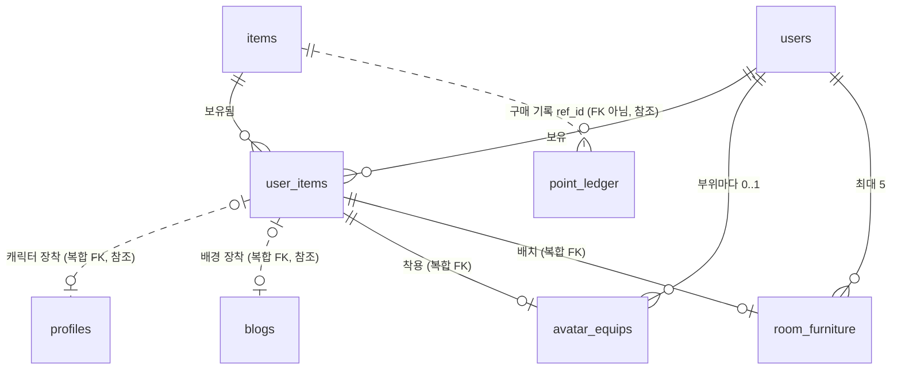

# Data Model: 상점 / 꾸미기 (SHOP)

Phase 1 결과다. 지금 DB(`src/db/schema.ts`, 마이그레이션 `0000`~`0006`)와 목표를 테이블마다 비교한다. 테이블 담당 규칙에 따라 shop 담당 표는 **변경**, 다른 spec 담당 표는 **참조**로 적는다. 결정 이유는 [research.md](research.md)의 R 번호를 따른다.

DB 표기는 지금 DB 규칙을 따른다: 글자는 `text`(+ 길이 CHECK), 번호는 `integer generated always as identity`, 시각은 `timestamptz`. ERD 부록의 `VARCHAR`·`SMALLINT` 표기는 문서 규칙이며 타입을 바꾸지 않는다.

## 1. 한눈에 보기

| 대상 | 구분 | 내용 |
|---|---|---|
| `item_type` (열거형) | 변경 | 값 `avatar`, `growth` 추가 (R1) |
| `avatar_slot` (열거형) | 변경 (새 열거형) | `hat`(모자), `outfit`(옷), `accessory`(소품) (R1) |
| `items` | 변경 (`growth`·`growth_value`는 요청: town, TOWN-09) | `avatar_slot`, `growth_value`, `is_on_sale` 추가 + CHECK 3개. 캐릭터·기본 아이템 판매 중단 데이터 이전 (R1~R3) |
| `user_items` | 변경 (요청: town, TOWN-09) | `quantity` 추가 (기본 1, ≥ 0) (R4) |
| `avatar_equips` | 변경 (새 테이블) | 회원·부위마다 착용 아이템 하나, 가진 것만 (R6) |
| `room_furniture` | 변경 (새 테이블) | 미니룸에 놓인 가구와 비율 위치, 최대 5개, 가진 것만 (R10) |
| `profiles` | 참조 | `character_item_id` + 복합 FK `profiles_character_owned_fk` 그대로 (캐릭터 장착). 착용은 별도 표라 구조 변경 요청 없음 (auth 담당) |
| `blogs` | 참조 | `background_item_id` + 복합 FK `blogs_background_owned_fk` 그대로 (배경 장착). `roof_color`는 town이 blog에 요청한 것으로 이 spec과 무관 (blog 담당) |
| `point_ledger` | 참조 | 구매 = `reason 'purchase'`, `coin_delta = −가격`, `ref_id = 아이템 ID`. 새 사유 없음 (game 담당) |
| `users` | 참조 | 회원 삭제(탈퇴) 때 새 표 두 개도 함께 지워진다 (auth 담당) |
| `user_animals` | 참조 | 성장 아이템을 쓰면 town이 `growth`를 늘린다. 수량 줄이기는 shop 도우미 `consumeGrowthItem` (town 담당) |

## 2. 엔터티

### 2.1 `items` — 아이템 카탈로그 (변경)

| 컬럼 | 현재 | 목표 | 비고 |
|---|---|---|---|
| `id` | integer identity PK | 그대로 | `최신순` 정렬 기준 (`id` 큰 순, R13) |
| `code` | text NOT NULL UNIQUE | 그대로 | 시드 덮어쓰기 기준 |
| `type` | `item_type` (character/background/furniture) | `item_type` (+ `avatar`, `growth`) | 상점 구역: avatar → `👕 아바타 꾸미기`, furniture → `🪑 가구`, background → `🖼 배경`, growth → `🌱 성장 아이템`. character는 상점에 없음 |
| `name` | text NOT NULL | 그대로 | |
| `description` | text NULL | 그대로 | 카드 2줄 |
| `price` | integer NOT NULL 기본 0, CHECK ≥ 0 | 그대로 | 운영 중 바꾸면 다음 구매부터 적용, 지난 원장은 그대로 |
| `required_level` | integer NOT NULL 기본 1, CHECK ≥ 1 | 그대로 | FR-016 |
| `is_starter` | boolean NOT NULL 기본 false | 그대로 | 가입 때 고르는/받는 기본 아이템. auth 가입 처리가 `type = 'character' AND is_starter`를 읽는다 |
| `asset_key` | text NOT NULL | 그대로 | `src/lib/art/`가 그림을 고르는 키 (R15) |
| `created_at` | timestamptz NOT NULL | 그대로 | |
| `avatar_slot` | 없음 | **`avatar_slot` NULL** | 아바타 꾸미기만 값이 있다 |
| `growth_value` | 없음 | **integer NULL** | 성장 아이템을 하나 쓸 때 자라는 양 |
| `is_on_sale` | 없음 | **boolean NOT NULL 기본 true** | 상점 목록·구매 가능 여부 (R3) |

새 CHECK (R2: 새 열거형 값은 글자로 비교)

```sql
CONSTRAINT items_avatar_slot_check   CHECK (("type"::text = 'avatar') = ("avatar_slot" IS NOT NULL))
CONSTRAINT items_growth_type_check   CHECK (("type"::text = 'growth') = ("growth_value" IS NOT NULL))
CONSTRAINT items_growth_value_check  CHECK ("growth_value" IS NULL OR "growth_value" > 0)
```

### 2.2 `user_items` — 보유 아이템 (변경, 요청: town TOWN-09)

| 컬럼 | 현재 | 목표 | 비고 |
|---|---|---|---|
| `user_id` | text NOT NULL FK → users CASCADE | 그대로 | PK |
| `item_id` | integer NOT NULL FK → items (삭제 동작 없음) | 그대로 | PK. 아이템 행은 지우지 않는다 (D12) |
| `acquired_at` | timestamptz NOT NULL | 그대로 | 처음 얻은 시각 (성장 아이템을 또 사도 바뀌지 않음) |
| `quantity` | 없음 | **integer NOT NULL 기본 1** + `user_items_quantity_check CHECK (quantity >= 0)` | 꾸미기 아이템은 늘 1, 성장 아이템은 살 때 +1·쓸 때 −1, 0이어도 행 유지 |

- PK (`user_id`, `item_id`)는 그대로 "아이템마다 한 줄"이자 "같은 꾸미기 아이템은 하나"(FR-010)를 지킨다.
- "보유"의 정의: `quantity > 0`. 상점 `보유 중`·`보유순`·`인기순`과 꾸미기 목록이 모두 이 기준을 쓴다 (spec 기본값: 0개면 보유 아님).
- 꾸미기 아이템의 `quantity = 1`은 코드 규칙이다(다른 표의 종류를 CHECK로 볼 수 없음). 꾸미기 구매는 upsert하지 않고 insert만 한다.

### 2.3 `avatar_equips` — 아바타 착용 상태 (변경, 새 테이블)

| 컬럼 | 타입 | 제약 | 설명 |
|---|---|---|---|
| `user_id` | text NOT NULL | PK, FK → `users.id` ON DELETE CASCADE | 입은 회원 |
| `slot` | `avatar_slot` NOT NULL | PK | 부위. 서버가 `items.avatar_slot`에서 정해 넣는다 |
| `item_id` | integer NOT NULL | 복합 FK (`user_id`, `item_id`) → `user_items` (`user_id`, `item_id`) ON DELETE CASCADE (`avatar_equips_owned_fk`) | 입은 아이템 |
| `equipped_at` | timestamptz NOT NULL 기본 now() | | 마지막으로 입은 시각 |

- PK (`user_id`, `slot`) = 부위마다 0개 또는 1개 (FR-039). 벗기 = 행 삭제.
- 복합 FK = 가진 아이템만 입는다 (FR-026, FR-041). ERD 3.4와 같은 방식.
- "그 아이템이 아바타이고 부위가 맞는지"는 서버 코드가 확인한다 (ERD 3.4 선례, R6).

### 2.4 `room_furniture` — 미니룸 가구 배치 (변경, 새 테이블)

| 컬럼 | 타입 | 제약 | 설명 |
|---|---|---|---|
| `user_id` | text NOT NULL | PK, FK → `users.id` ON DELETE CASCADE | 미니룸 주인 (회원 = 블로그 1:1) |
| `item_id` | integer NOT NULL | PK, 복합 FK (`user_id`, `item_id`) → `user_items` ON DELETE CASCADE (`room_furniture_owned_fk`) | 놓은 가구 |
| `slot` | smallint NOT NULL | `room_furniture_slot_check CHECK (slot BETWEEN 1 AND 5)`, `room_furniture_slot_uq UNIQUE (user_id, slot)` | 자리 번호. 미니룸 하나에 최대 5개를 DB가 막는다 (FR-033) |
| `x` | real NOT NULL | `room_furniture_position_check CHECK (x BETWEEN 0 AND 100 AND y BETWEEN 0 AND 100)` | 가구 아랫변 가운데의 가로 위치 (미니룸 너비 대비 %) |
| `y` | real NOT NULL | (위와 같음) | 가구 아랫변의 세로 위치 (미니룸 위에서부터 %) |
| `placed_at` | timestamptz NOT NULL 기본 now() | | 처음 놓은 시각 |
| `updated_at` | timestamptz NOT NULL 기본 now(), 고칠 때 갱신 | | 마지막으로 옮긴 시각 |

- PK (`user_id`, `item_id`) = 같은 가구는 한 번만 놓인다 (같은 가구는 하나만 가짐, spec 기본값).
- 그리기 순서: `y` 오름차순(아래쪽 가구가 앞), 캐릭터는 늘 맨 앞 (R12). 자리 번호는 그리기와 상관없다.
- "가구 종류만 놓는다"는 서버 코드가 확인한다.

### 2.5 열거형

| 열거형 | 현재 | 목표 | 마이그레이션 |
|---|---|---|---|
| `item_type` | `character`, `background`, `furniture` | + `avatar`, `growth` (뒤에 붙음) | `ALTER TYPE "public"."item_type" ADD VALUE …` 2줄. 같은 실행에서 새 값을 리터럴로 쓰지 않는다 (R2) |
| `avatar_slot` | 없음 | `hat`, `outfit`, `accessory` | `CREATE TYPE` (같은 실행에서 바로 써도 됨) |

`ledger_reason`(game 담당)은 바꾸지 않는다. 성장 아이템 구매도 `purchase`다.

## 3. 관계



- 회원 1 ── 착용 0..3 (부위 3개), 회원 1 ── 배치 0..5.
- 보유 한 줄 ── 착용 0..1 (한 아이템은 한 부위에만), 보유 한 줄 ── 배치 0..1.

## 4. 검증 규칙

| 규칙 | DB가 막는 것 | 서버 코드가 확인하는 것 (Server Action) | FR / SC |
|---|---|---|---|
| 살 수 있는 아이템만 | - | `is_on_sale = true` 이고 `is_starter = false`, ID는 `parseId` | FR-004, FR-009, FR-011 |
| 같은 꾸미기 아이템 하나 | `user_items` PK | 잠금 안에서 보유 확인 → `이미 가지고 있는 아이템이에요` | FR-010, SC-002 |
| 레벨 | `items.required_level >= 1` | 잠금 안에서 원장 합계로 그 순간의 레벨 | FR-016~018 |
| 코인 음수 금지 | (잔액 컬럼 없음) | 잠금 안에서 원장 합계 ≥ 가격, 같은 트랜잭션에서 지급 + `−가격` | FR-019~020, SC-003 |
| 성장 아이템 수량 | `quantity >= 0` CHECK | 사면 +1(upsert), 쓰면 `quantity > 0`일 때만 −1 | FR-042~045, SC-009 |
| 가진 것만 장착 | 복합 FK (`profiles`, `blogs`) | `user_items` + `quantity > 0` 확인 | FR-026 |
| 가진 것만 착용 | 복합 FK (`avatar_equips`) | 같음 | FR-041 |
| 부위마다 하나 | `avatar_equips` PK (`user_id`, `slot`) | 부위는 `items.avatar_slot`에서 | FR-039 |
| 캐릭터·배경 하나씩 | NOT NULL 컬럼 하나 | - | FR-028 |
| 장착 종류 | - | 캐릭터 → `profiles`, 배경 → `blogs`, 아바타 → `avatar_equips`, 그 밖 → `아직 장착할 수 없는 종류예요` | FR-027 |
| 가진 가구만 배치 | 복합 FK (`room_furniture`) | 보유·`type = 'furniture'` 확인 | FR-034 |
| 가구 5개 | `slot` 1~5 CHECK + UNIQUE (`user_id`, `slot`) | 잠금 안에서 빈 자리 번호를 고름, 없으면 `가구는 5개까지 놓을 수 있어요` | FR-033 |
| 위치 비율 | `x`, `y` 0~100 CHECK | zod로 유한한 숫자 0~100, 소수 둘째 자리 반올림 | FR-035 |
| 판매 중단 캐릭터 유지 | `user_items`·`profiles` 행을 지우거나 바꾸는 이전 없음 | - | FR-011, SC-010 |

## 5. 상태 전이

**아이템 판매 상태** (`items.is_on_sale`, 운영자·마이그레이션·시드가 바꿈)

| 지금 | 사건 | 다음 | 영향 |
|---|---|---|---|
| 판매 중 | 판매 중단 (시드에서 `isOnSale: false`) | 판매 중단 | 상점에서 사라지고 구매 요청은 `살 수 없는 아이템이에요`. 이미 가진 회원은 그대로 보유·장착 |
| 판매 중단 | 다시 판매 | 판매 중 | 다시 보인다 |
| 기본 아이템 | - | 늘 판매 중단 | 가입 때만 받는다 |

**보유 상태** (`user_items`)

| 종류 | 지금 | 사건 | 다음 |
|---|---|---|---|
| 꾸미기 (아바타·가구·배경) | 없음 | 구매 | 보유 (`quantity = 1`) |
| 꾸미기 | 보유 | 구매 요청 | 그대로 (`이미 가지고 있는 아이템이에요`). 되팔기·환불 없음 (FR-012) |
| 성장 아이템 | 없음 또는 `quantity = n` | 구매 | `quantity = n + 1` (행이 없으면 1로 생김) |
| 성장 아이템 | `quantity = n > 0` | 농장에서 사용 (town) | `quantity = n − 1` |
| 성장 아이템 | `quantity = 0` | 사용 요청 | 그대로 (town이 거부), 행은 남음, "보유 아님" |

**장착·착용 상태**

| 대상 | 지금 | 사건 | 다음 |
|---|---|---|---|
| 캐릭터 / 배경 | A 장착 | 가진 B 장착 | B 장착 (늘 정확히 하나, 벗기 없음) |
| 부위 (모자·옷·소품) | 비어 있음 | 가진 A 입기 | A |
| 부위 | A | 같은 부위 B 입기 | B |
| 부위 | A | A 벗기 (`unequipAvatar`) | 비어 있음 |

**가구 배치** (`room_furniture`)

| 지금 | 사건 | 다음 |
|---|---|---|
| 보관 (안 놓임), 놓인 수 < 5 | 미니룸 안에 놓기 | 놓임 (빈 자리 번호, `x`, `y`) |
| 보관, 놓인 수 = 5 | 놓기 | 그대로 (`가구는 5개까지 놓을 수 있어요`) |
| 놓임 | 미니룸 안으로 끌어 옮기기 | 놓임 (새 `x`, `y`, 같은 자리 번호) |
| 놓임 | 미니룸 밖으로 끌어내기 | 보관 (행 삭제, 자리 번호 빔) |

## 6. 삭제 규칙 (ERD 3.14에 더할 것)

| 지워지는 것 | 함께 처리 |
|---|---|
| 회원 (탈퇴, auth) | `user_items` CASCADE → `avatar_equips`, `room_furniture` CASCADE (각 표의 `user_id` → `users` CASCADE도 있음). `scripts/reset-dev.ts`의 `TRUNCATE users … CASCADE`도 두 표를 비운다 |
| 아이템 (`items` 행) | 지우지 않는다. `user_items.item_id` FK(삭제 동작 없음)가 막는다. 판매 중단은 `is_on_sale = false` |
| 보유 행 (`user_items`) | 앱이 지우는 경로가 없다 (성장 아이템도 0으로 남김). 회원 삭제 때만 지워진다 |

## 7. 마이그레이션 순서와 기존 데이터 이전

번호는 구현할 때의 다음 번호다(지금 마지막 `0006_blog_visits`). 내용 이름으로 적는다. 다른 spec 마이그레이션이 먼저 merge되면 최신 `main`에서 다시 생성한다.

| 순서 | 이름 (가칭) | 만드는 법 | 내용 | 기존 데이터 |
|---|---|---|---|---|
| 1 | `shop_items` | `src/db/schema.ts` 수정 → `npm run db:generate` | `item_type` ADD VALUE `avatar`·`growth`, `CREATE TYPE avatar_slot`, `items` 컬럼 3개 + CHECK 3개, `user_items.quantity` + CHECK | `quantity`는 `DEFAULT 1 NOT NULL`로 더해져 기존 행이 모두 1 (ERD 7장 6-2). `is_on_sale`은 기본값 true로 채워짐 → 2에서 고침 |
| 2 | `shop_stop_character_sales` | 직접 쓴 SQL (`npx drizzle-kit generate --custom --name=shop_stop_character_sales`, 구현 전 옵션 확인) | `UPDATE "items" SET "is_on_sale" = false WHERE "is_starter" OR "type" = 'character';` | 캐릭터 11행(기본 2 + 과거 판매 9)과 초원이 판매 중단. 보유·장착·원장은 건드리지 않는다. 여러 번 실행해도 같다 |
| 3 | `avatar_equips` | 스키마 → `db:generate` | 표·PK·FK 2개 | 빈 표로 시작 (지금 착용 데이터 없음) |
| 4 | `room_furniture` | 스키마 → `db:generate` | 표·PK·UNIQUE·CHECK 2개·FK 2개 | 빈 표로 시작 |

- 각 SQL 맨 위에 요구사항 ID를 단 한국어 주석을 붙인다 (관례: `drizzle/0004_attachments.sql`, `drizzle/0006_blog_visits.sql`). 예: `-- SHOP-01·SHOP-06, TOWN-09 (2026-10-07): 상점 아이템 종류(아바타·성장), 판매 여부, 성장치, 보유 수량`.
- 1과 2는 같은 실행(한 트랜잭션, R2)에서 돌아도 된다: 2는 예전 값 `character`만 쓴다.
- 3·4는 User Story 우선순위(US4 P2, US7 P3)대로 따로 merge할 수 있게 나눴다. 함께 대기 중이어도 문제없다.
- 첫 출시 아이템(새 열거형 값 사용)은 마이그레이션이 아니라 시드로 넣는다 (8장).
- 되돌리기(down) 마이그레이션은 이 저장소 관례에 없다.

적용 뒤 확인(quickstart의 S-00): 캐릭터는 모두 `is_on_sale = false`, `user_items`에 `quantity <> 1`인 행이 없음, `profiles`·`blogs` 장착과 `point_ledger` 합계가 적용 전과 같음.

## 8. 시드 (`scripts/seed.ts`의 `ITEMS`, shop 담당)

`code` 기준으로 넣거나 덮어쓴다(지금 방식). `onConflictDoUpdate`의 `set`에 `avatarSlot`, `growthValue`, `isOnSale`을 더한다. 새 17종의 설명(`description`)은 화면에 보이지만 spec·원본에 문구가 없어 구현 때 카드 2줄 안으로 쓰고 PR에서 팀이 확인한다 (R19). 기존 17종의 설명은 지금 시드 그대로 둔다. 아래 순서로 넣으면 `최신순`에서 새 아이템이 배경보다 먼저 나온다.

**기존 행 (값 변경은 판매 여부뿐)**

| code | 종류 | 이름 | 가격 · 레벨 | `is_starter` | `is_on_sale` |
|---|---|---|---|---|---|
| `char_boy`, `char_girl` | character | 남자 주민, 여자 주민 | 0 · 1 | true | false |
| `char_human`, `char_cat`, `char_dog`, `char_rabbit`, `char_fox`, `char_panda`, `char_robot`, `char_dragon`, `char_unicorn` | character | 모험가 ~ 유니콘 | 지금 값 그대로 | false | **false** (행 유지, D12) |
| `bg_meadow` | background | 초원 | 0 · 1 | true | false |
| `bg_beach`, `bg_snow`, `bg_sakura`, `bg_night`, `bg_space` | background | 바닷가 120·1, 눈 마을 200·2, 벚꽃길 300·3, 밤의 도시 450·4, 우주 900·6 | 그대로 | false | true |

**새 행 (FR-013, 첫 출시 초기값)**

| code | 종류 | 부위 | 이름 | 🪙 가격 | 필요 레벨 | 성장치 | `asset_key` |
|---|---|---|---|---|---|---|---|
| `hat_straw` | avatar | hat | 밀짚모자 | 50 | 1 | - | `hat.straw` |
| `hat_ribbon` | avatar | hat | 리본 | 60 | 1 | - | `hat.ribbon` |
| `hat_beanie` | avatar | hat | 털모자 | 80 | 2 | - | `hat.beanie` |
| `outfit_overalls` | avatar | outfit | 멜빵바지 | 100 | 1 | - | `outfit.overalls` |
| `outfit_hoodie` | avatar | outfit | 후드티 | 150 | 2 | - | `outfit.hoodie` |
| `outfit_dress` | avatar | outfit | 원피스 | 200 | 3 | - | `outfit.dress` |
| `acc_glasses` | avatar | accessory | 안경 | 70 | 1 | - | `acc.glasses` |
| `acc_scarf` | avatar | accessory | 목도리 | 120 | 2 | - | `acc.scarf` |
| `acc_bag` | avatar | accessory | 가방 | 180 | 3 | - | `acc.bag` |
| `furn_pot` | furniture | - | 화분 | 60 | 1 | - | `furn.pot` |
| `furn_chair` | furniture | - | 의자 | 80 | 1 | - | `furn.chair` |
| `furn_lamp` | furniture | - | 램프 | 120 | 2 | - | `furn.lamp` |
| `furn_desk` | furniture | - | 책상 | 150 | 2 | - | `furn.desk` |
| `furn_bed` | furniture | - | 침대 | 250 | 3 | - | `furn.bed` |
| `growth_feed` | growth | - | 동물 먹이 | 20 | 1 | 20 | `growth.feed` |
| `growth_premium` | growth | - | 고급 먹이 | 60 | 1 | 50 | `growth.premium` |
| `growth_booster` | growth | - | 성장 촉진제 | 150 | 3 | 100 | `growth.booster` |

모두 `is_starter = false`, `is_on_sale = true`. 결과: 판매 중 22개 = 아바타 9 · 가구 5 · 배경 5 · 성장 3 (SC-011). 전체 34행.

## 9. `docs/02-erd.md`에서 고칠 곳 (shop 담당 부분)

| 위치 | 고칠 내용 |
|---|---|
| 1장 관계도 | `items`에 `avatar_slot`·`is_on_sale` 추가, `item_type` 설명에 `avatar`, `user_items`에 `quantity`(이미 ⏳ 표시) 확정, `avatar_equips`·`room_furniture` 표와 관계 추가 |
| 2장 테이블 그룹 | 아이템 그룹에 `avatar_equips`, `room_furniture` (SHOP-05·06) |
| 3.4 | 착용(`avatar_equips`)·배치(`room_furniture`)도 같은 복합 FK로 "가진 것만" |
| 3.7 | 복합 PK 표에 `avatar_equips` (`user_id`, `slot`) "부위마다 하나", `room_furniture` (`user_id`, `item_id`) "같은 가구 한 번" + UNIQUE (`user_id`, `slot`) "5개" |
| 3.11 | 성장 아이템의 ⏳ 해제(구현 뒤), 수량 줄이기는 `consumeGrowthItem` |
| 3.14 | 회원 삭제 → 착용·배치 삭제 |
| 3.15 | `item_type`에 `avatar`, 새 `avatar_slot` |
| 3.17 | 2NF 표에 두 표, BCNF 후보 키에 `room_furniture (user_id, slot)` |
| 5장 | "아바타 꾸미기 테이블 설계 전" → 별도 표로 결정 |
| 7장 | 6-2의 shop 부분(`growth`, `growth_value`, `quantity`) + 새 줄(판매 여부·아바타·가구) |
| 부록 | NULL 허용에 `items.avatar_slot`, 타입 표에 `room_furniture.x`·`y`(비율 실수), `slot`(SMALLINT) |
